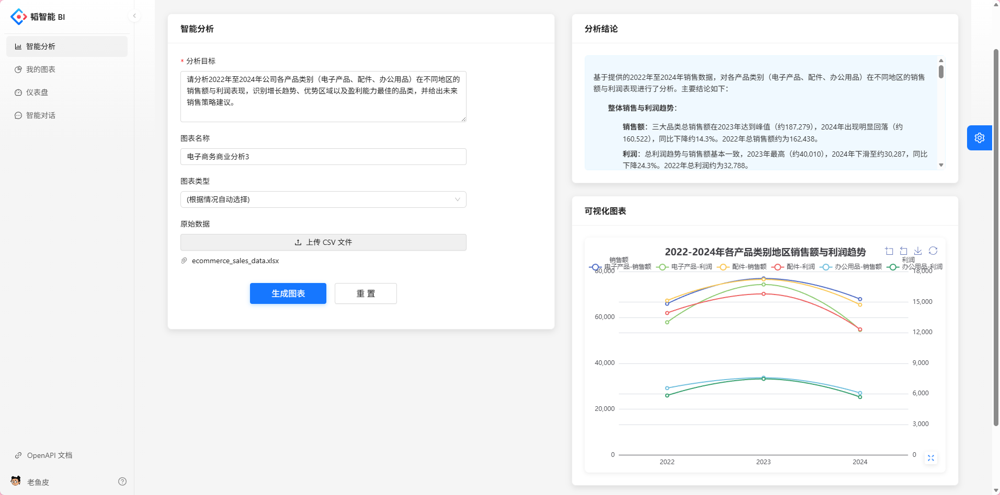
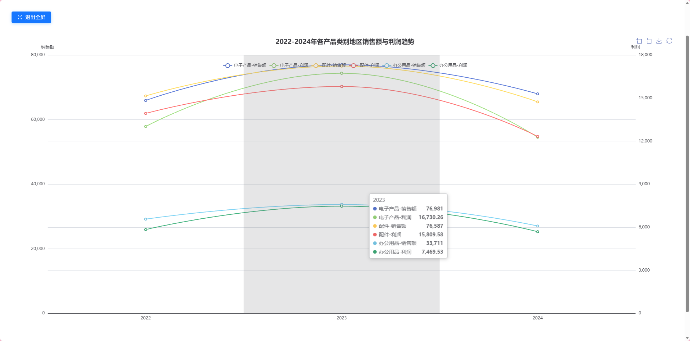
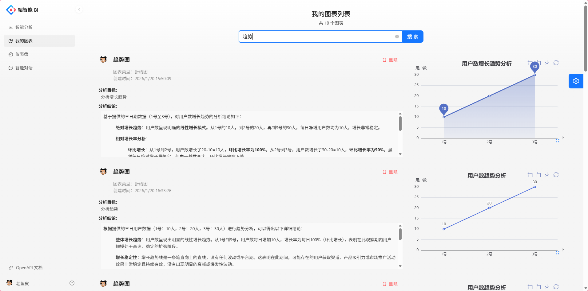
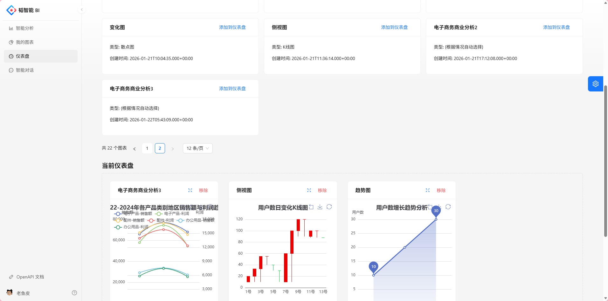
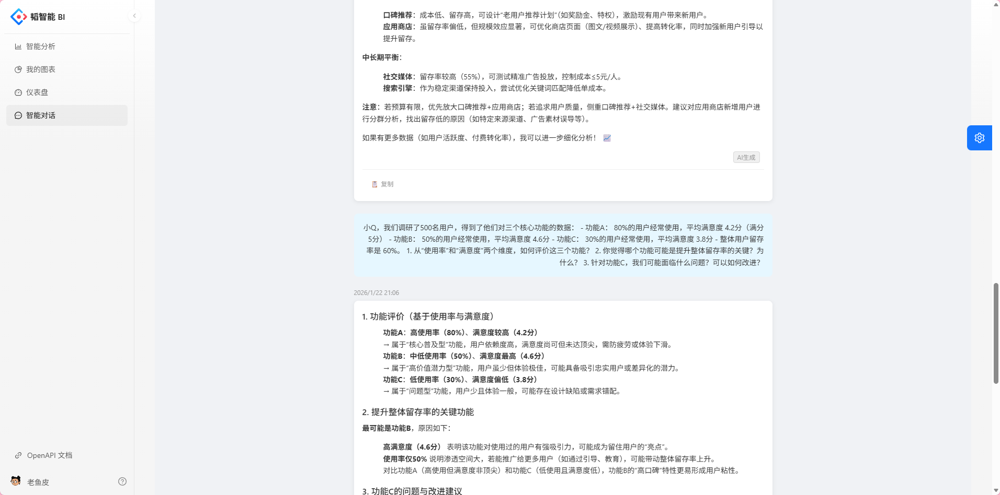

# 智能BI数据分析平台

## 项目简介
+ 本项目是一套 "智能数据分析与可视化系统" ，旨在为用户提供直观、高效的数据洞察工具。系统支持用户查看和管理图表列表，通过可视化展示数据趋势，结合AI对话功能辅助分析，帮助用户快速理解数据背后的业务价值。
+ 系统解决了传统数据分析工具操作复杂、响应缓慢的问题，适用于企业和组织的业务决策场景，可帮助用户从海量数据中提取关键信息，提升决策效率和准确性。

### 界面展示












## 技术栈

### 前端
- React 18
- Ant Design Pro 6
- ECharts
- UmiJS 4
- TypeScript

### 后端
- Spring Boot 2.7.2
- MyBatis-Plus 3.5.2
- MySQL
- Redis + Redisson
- Elasticsearch
- RabbitMQ
- DeepSeek API

## 功能特性

### 核心功能
- ✅ 智能图表生成（同步/异步）
- ✅ AI数据分析对话
- ✅ Excel数据上传与解析
- ✅ 图表可视化展示
- ✅ 用户认证与权限管理
- ✅ 异步任务处理
- ✅ 系统限流保护

### 技术亮点
- 双模式图表生成（同步即时反馈，异步处理大任务）
- 基于Redis的用户级别限流
- 线程池实现异步任务处理
- 状态机管理任务生命周期
- 集成DeepSeek-V3.2大模型实现智能分析
- 腾讯云COS对象存储

## 快速开始

### 前端启动
```bash
# 进入前端目录
cd yubi-frontend

# 安装依赖
npm install

# 启动开发服务器
npm start
```

### 后端启动
```bash
# 进入后端目录
cd yubi-backend

# 启动应用
mvn spring-boot:run
```

## 项目结构

### 前端结构
```
yubi-frontend/
├── src/
│   ├── pages/            # 页面组件
│   │   ├── AddChart/     # 同步图表生成
│   │   ├── AddChartAsync/ # 异步图表生成
│   │   ├── AiChat/       # AI聊天
│   │   ├── MyChart/      # 我的图表
│   │   └── MyChartAsync/ # 我的异步图表
│   ├── services/         # API服务
│   └── components/       # 通用组件
└── config/               # 配置文件
```

### 后端结构
```
yubi-backend/
├── src/main/java/
│   └── com/yupi/springbootinit/
│       ├── controller/   # 控制器
│       ├── service/      # 业务逻辑
│       ├── mapper/       # 数据访问
│       ├── model/        # 数据模型
│       ├── config/       # 配置
│       ├── manager/      # 管理器
│       └── utils/        # 工具类
└── sql/                  # SQL脚本
```

## 核心功能

### 1. 智能图表生成
- 支持上传Excel文件
- 选择图表类型
- 输入分析目标
- 同步/异步生成图表
- 查看分析结论

### 2. AI数据分析对话
- 与AI助手进行数据分析对话
- 获得专业的数据解读
- 支持图表建议和优化

### 3. 我的图表管理
- 查看历史生成的图表
- 编辑和删除图表
- 导出图表数据

## 注意事项

1. **环境配置**
   - 后端需要配置MySQL、Redis、Elasticsearch等服务
   - 需要配置腾讯云COS和OpenAI API密钥

2. **依赖管理**
   - 前端使用pnpm/npm管理依赖
   - 后端使用Maven管理依赖

3. **安全配置**
   - 生产环境需修改默认配置和密钥
   - 建议使用HTTPS协议

4. **性能优化**
   - 大数据量分析建议使用异步模式
   - 可根据服务器配置调整线程池参数

